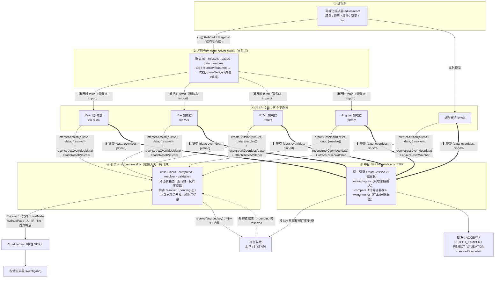

# 原型：增量计算 + 异步取数（信用证场景）

> 关联：[异步/规模架构补充](../unified_dsl_async_scale.md) · [架构](../unified_dsl_architecture.md)
> 验证 **ADR-7（Resolver 异步注入）** 与 **ADR-8（增量依赖图）** 在信用证(L/C)场景的可行性。
>
> 进阶（本引擎之上，均已完成）：**一套规则/页面 → 四端渲染**（Angular / React / Vue / 原生 HTML，逐值一致）
> 见 [MULTI-FRAMEWORK.md](MULTI-FRAMEWORK.md)；**可视化规则/参数编辑器**（Phase 1 + Phase 2 全部）见
> [editor-fullspec.md](editor-fullspec.md)（编辑器在 `editor-react/`）。

## 看什么

本原型以**第三方接入**方式组织（同 `../poc/third-party-sample.html` 的风格）：引擎是一个
`<script>` 引入的发行版，页面是第三方（"GlobalTrade Bank"）自己的代码。

先生成发行版与规则产物：

```bash
cd poc-incremental
npm install
node build-dist.mjs        # → dist/unified-dsl-incremental.js + rules/lcSettlement.rules.js
```

然后**双击 `third-party-incremental.html`**（若浏览器拦截本地 `<script src>`，用 `npx serve` 起静态服）：

- 改某条收费的 **金额** → 右侧"引擎事件"只出现 `该行 base`、`total`、`校验` 几条
  → **增量**：其余收费行零重算。
- 改某条收费的 **币种** → 该行 `fxRate` 异步重取（本行汇率服务，延时 0.9s），
  期间该行 `base`、`total`、校验显示 **"计算中"**（pending），取回后自动结算
  → **异步 resolver + pending 态传播**。
- 下方 **钉值快照** 展示每条汇率的 `value + key + rateId`（随交易提交给后台复算）。

或跑脚本化场景（带断言，验证引擎本身）：

```bash
node run-scenario.mjs      # 打印 T0~T5，断言增量子图 + 子项增删
```

## ▶ 中台校验 + 篡改演示（BFF）

演示 **ADR-2/ADR-3**：UI 提交的计算值不可信，**中台用原始输入权威重算并比对**，篡改即被识破。

```bash
# 1) 启动 BFF（中台校验服务）
node bff/server.js          # → http://localhost:8787

# 2) 双击 third-party-incremental.html，操作：
#    - 结算区的「收费合计 / 净额」、每条明细的 base、每组 subtotal 都是【可编辑的计算值】
#    - 随便改一个（输入框变红 = 已篡改）
#    - 点「⬆ 提交到中台校验」
#    → 中台返回 ⛔ REJECT_TAMPER，并列出：字段 / 前端提交值 / 中台重算值
#    - 不篡改直接提交 → ✅ ACCEPT
```

中台逻辑（`bff/validate.js`）：
1. **只取原始输入**（剔除所有 computed / external 字段，一律以中台为准）；
2. 用**同一引擎 + 权威汇率**重算（路线 B：BFF 是 Node，跑同一份 JS 内核；生产中 Java 中台编译同一内核复算，结论一致）；
3. 把重算的**计算值**与前端提交逐一比对 → 不一致即 `divergence`（计算值篡改）；
4. **钉值汇率权威复核（ADR-9）**：拿中台权威汇率源，按 `dataSources.tolerance` 容差复核前端提交的每条钉值 → 超容差即 `rate` 篡改；
5. 再跑权威业务校验 → 裁决 `ACCEPT / REJECT_TAMPER / REJECT_VALIDATION`。

> 两层防线：
> - **计算值**：前端改任何 base/subtotal/total/net（哪怕三层深），中台只认原始输入重算的结果，立即定位。
> - **钉值汇率**：攻击者就算把汇率和依赖它的计算值改得"内部自洽"，中台拿自己的权威汇率一复核（带容差，放行正常漂移），照样识破。
> 页面里汇率、base、subtotal、合计、净额都可编辑——随便改，提交即被拒并列出"前端 vs 中台权威值"。

## ▶ 规则仓库（文件式）+ 运行时加载：前后贯通

演示**硬约束**——规则不编译进前端包，运行时按 feature 动态拉取。三段打通：
**编辑器产出 → 仓库文件 → 运行时页拉取渲染**。

```bash
# 1) 启动规则仓库服务（:8788；store/ 为空会自动种子化现有 lcSettlement 交易）
node store-server.js          # 或 npm run store
#   store/ = { libraries/ rulesets/ pages/ data/ features/ } 各存 JSON 文件
#   GET /api/catalog · /api/bundle/:featureId（一次拉齐 ruleSet+库+页面+数据）· PUT 各类

# 2) 运行时加载器（新样本，零静态 import——启动即 fetch 仓库渲染）
cd runtime-loader && npm install && npm run dev
#   顶部下拉选 feature → 从仓库拉规则/页面渲染，net=82203.22 与四端一致

# 3) 可视化编辑器接仓库：编辑器「仓库」标签页 →「保存到仓库」/「加载」
cd editor-react && npm run dev    # /api 由 Vite proxy 代到 :8788
#   在编辑器改动 → 保存到仓库 → 刷新 runtime-loader → 改动即现（前后贯通）

# 端到端回归（需 store-server 已启动）
node verify-store.mjs         # catalog/bundle/PUT→GET 往返 + 仓库规则喂引擎 net=82203.22
```

> 仓库是**发布目标**；编辑器仍保留 localStorage 本地草稿。BFF 从仓库读同源规则复算留待下一轮。
> `store/` 是可变运行时数据（已 gitignore），由 `seed-store.mjs` 生成或 store-server 空库自动种子化。

## 第三方接入只需三步

```html
<!-- ① 引入增量引擎（全局 UnifiedDSL） -->
<script src="dist/unified-dsl-incremental.js"></script>
<!-- ② 运行时加载规则（生产中替换为 fetch Rule Bundle API） -->
<script src="rules/lcSettlement.rules.js"></script>
<script>
  // ③ 你自己的汇率服务（引擎不碰 IO，只通过 resolve 拿值）
  function myFxApi(source, key){ return fetch(...).then(...); }  // 返回 {value, asOf, rateId}
  const session = UnifiedDSL.createSession(window.LC_RULES, data, {
    resolve: myFxApi,
    onUpdate: s => render(s),     // 增量结果回调
    onLog:    e => log(e),        // 重算/取数事件（可选，用于观察）
  });
  // 字段用全路径定位（任意深度）：root.charges[0].items[0].amount
  session.setInput("root.charges[0].items[0].amount", "12000");   // → 只增量重算该明细那条链
</script>
```

要点：**规则、数据、汇率服务都由第三方在运行时提供**；引擎是 headless 的，既不碰 DOM 也不碰 IO。

## 架构总览

一套规则、四端运行、中台同源可验证。数据流：**编辑器产出规则 → 仓库 → 运行时按 feature 拉取 → 同一引擎渲染 → 提交中台权威重算防篡改**。



**分层职责**：

| 层 | 是什么 | 关键点 |
|---|---|---|
| ① 编辑器 | 可视化编写模型/规则/模块/页面 | 产出 `RuleSet`（模型+规则+模块+数据源）+ `PageDef`，发布期 lint |
| ② 仓库 | 文件式规则库（`store/`） | 规则**不编译进前端包**，运行时按 `featureId` 拉 bundle（编辑器一存即生效） |
| ③ 加载面 | React/Vue/HTML/Angular + 编辑器 Preview | 各一个 ctx 适配器包 `createSession`；同一份规则、四端同结果 |
| ④ 引擎 | `incremental.js` | 增量反应式依赖图（非流式）；纯计算、不碰 IO；见 [COMPUTE-MODEL.md](COMPUTE-MODEL.md) |
| ⑤ ui-kit-core | 框架无关 SDK | `EngineCtx` 契约 + `hydrate`→UI-IR + `lint` + 自动布局；四端共享 |
| ⑥ 中台 BFF | `validate.js` | **用同一引擎**重算：只信原始输入、按 key 重取权威汇率，比对计算值/钉值防篡改 |

**两条外部数据线**（见 COMPUTE-MODEL「中台两条汇率处理线路」）：resolver 按 `resolve(source,key)` 取值进计算（前端 mock / 后台权威）；提交的 `pinned` 只做容差核对不进计算。**覆盖态**不单独持久化——存纯值树，加载时四端一致地从值反推（见「加载态重建」）。

## 引擎怎么做到的

`src/incremental.js` —— 一个 **带异步节点的响应式计算图**（≈"无界面电子表格内核"）：

> 它是**增量反应式依赖图计算**，不是流式计算（stream processing）——两者辨析见
> [COMPUTE-MODEL.md](COMPUTE-MODEL.md)。

- 每个"节点.字段"是图里一个 **cell**（input / computed / resolver / validation）。
- **任意深度 + 多分支子集合**：递归节点注册表 + 按类型索引；模型 `children` 可为数组
  （如 LC 同时有 `charges` 与 `payments`），可无限嵌套（LC → 收费组 → 收费明细）。
  表达式按集合名聚合：`sum(items.base)`、`sum(charges.subtotal)`。
- **依赖自动建边**：求值时经 Proxy 读到的每个 cell 自动记为依赖，
  跨层聚合 / 真实父子链都自动建图，无需手写。
- **改一个 input** → 只把其 **下游** 标脏 → 按依赖就绪顺序重算 → O(受影响子图)。
  改一条三层深的明细，只重算 `该明细 → 其组小计 → 收费合计 → 净额 → 校验`，
  其余收费组、付费分支、付费合计**零触碰**。
- **resolver 是异步 cell**：其 `key` 输入变化 → 置 `pending` + 发起取数 →
  下游读到 `pending` 抛出并传播（`pending ≠ null`，校验对其**挂起**而非判失败）→
  取回后写值、标脏下游、再结算。
- 取数结果写入 **钉值快照**（value + source + key + asOf + rateId），供中台一致复算。

## 与全量重算引擎的对比

| | `../poc/js/src/engine.js` | `src/incremental.js` |
|---|---|---|
| 触发一次改动 | 全量重算所有规则 | 只重算受影响子图 |
| 外部数据(汇率) | 无（纯同步） | resolver 异步注入 + pending 态 |
| 适用 | 中小表单 | **上千栏位、嵌套子记录、计算含取数** |
| 一致性 | 同输入同输出 | 同（输入含钉死的 resolved 值） |

引擎仍是**纯**的：汇率对它只是个字段；IO 在引擎之外（fx-service）。ADR-1 路线 B 不受影响。

## 文件

```
poc-incremental/
├── src/
│   ├── kernel.js              # 表达式内核（复制自 poc/js/src，单源）
│   ├── incremental.js         # ★ 增量依赖图引擎 + 异步 resolver
│   └── fx-service.js          # mock 汇率服务（仅 run-scenario.mjs 用；第三方页面用自己的）
├── build-dist.mjs            # 打包引擎为第三方发行版 + 导出规则产物
├── dist/
│   └── unified-dsl-incremental.js   # ★ 发行版（全局 UnifiedDSL.createSession）
├── rules/
│   ├── lcSettlement.rules.js        # 运行时加载的规则产物（window.LC_RULES）
│   └── lcSettlement.json            # 同内容 JSON，供 fetch 方式
├── third-party-incremental.html     # ★ 第三方页面（数据/汇率/UI + 计算值可篡改 + 提交校验）
├── bff/
│   ├── server.js                     # ★ BFF 中台校验 HTTP 服务（:8787）
│   └── validate.js                   # 中台校验核心：原始输入权威重算 + 比对裁决
├── store-server.js                   # ★ 文件式规则仓库服务（:8788）catalog/bundle/CRUD
├── seed-store.mjs                    # 把现有 JSON 种子化进 store/（store-server 空库自动调用）
├── store/                            # 仓库数据（gitignore）：libraries/ rulesets/ pages/ data/ features/
├── runtime-loader/                   # ★ 运行时加载器样本：启动即从仓库按 feature 拉取渲染（零静态 import）
├── verify-store.mjs                  # 仓库端到端回归（catalog/bundle/往返 + 喂引擎真值）
├── lc-rules.json / lc-data.json      # 规则与初始数据源
└── run-scenario.mjs                  # 脚本化场景（带增量断言）
```

## 边界（原型范围）

- ✅ **任意深度嵌套 + 多分支子集合**：已支持（递归实例化层）。
- ✅ **联动重置**：已支持（`PageDef.resetRules` + `attachResetWatcher`）。某字段变真时清空其它输入字段
  （引擎无此通路，宿主层边沿触发补上；纯 UI 便利、BFF 不感知）。机制辨析见 [COMPUTE-MODEL.md](COMPUTE-MODEL.md)。
- ✅ **子项增删**：已支持。`session.addChild(parentPath, collName, obj)` 动态补建子树 cell；
  `session.removeChild(childPath)` 用"墓碑"回收 cell（保持兄弟下标稳定、in-flight 取数安全丢弃），
  父聚合自动增量更新。第三方页面已有增删按钮。
- resolver 失败仅置 `error` + 告警；重试/缓存/容差留待工程化。
- 本版扩展了 `src/kernel.js`（仅此副本）的路径求值以支持"按集合名聚合 / 深路径"；
  正式纳入时应回填到 canonical kernel 与表达式规范。
- 这是**前端 UI 运行时**演示；中台用钉死的 resolved 值复算、divergence 监控等按架构补充文档推进。
